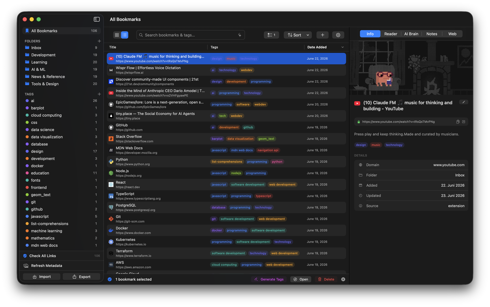
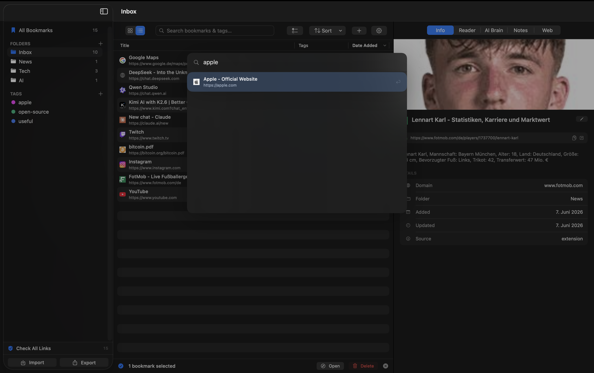
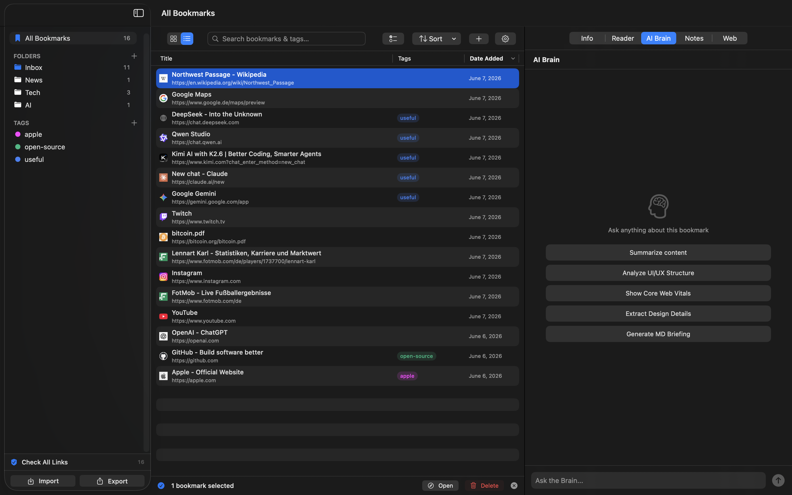
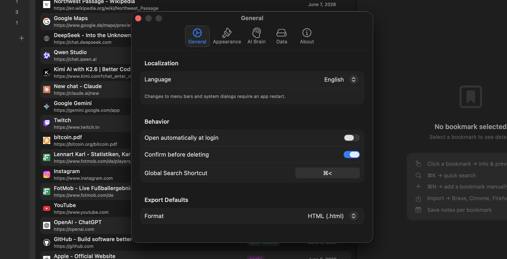

<div align="center">


# Gyrus

**The open-source, private, and local-first bookmark manager for macOS.**

Collect, organize, and rediscover your bookmarks on your own Mac.  
No accounts required, no cloud sync, and zero telemetry.

[](#requirements)
[](LICENSE)
[](#project-status)
[](https://developer.apple.com/swiftui/)
[](https://api.tiangolo.com)
[](CONTRIBUTING.md)

[**Download the latest App**](https://github.com/gedankenlust/Gyrus/releases) · [Features](#features) · [Screenshots](#screenshots) · [Quick start](#quick-start) · [AI Brain](#ai-brain-optional) · [Architecture](#architecture)

</div>

---

> **New here?** The step-by-step guide in **[GETTING_STARTED.md](GETTING_STARTED.md)**
> walks you through everything in English **and** German (Englisch **und** Deutsch).

## What is Gyrus?

<p align="center">
  
</p>

Gyrus is a native macOS app for people who collect a lot of links and want to
actually *find* them again. It combines the speed of a native desktop app with
the power of local AI to help you organize and query your knowledge base.

Import your browser's bookmarks, sort them into folders and colored tags, search
the full text in milliseconds, and use **AI Auto-Tags** to categorize your
library effortlessly. With **Global Search**, your bookmarks are always just a
shortcut away, no matter which app you're in.

## 🚀 Download & Install

**Just want to use the app?**  
Download the latest **`Gyrus.dmg`** from the [Releases](https://github.com/gedankenlust/Gyrus/releases) page. Open the disk image and drag Gyrus to your Applications folder.

*Note: Gyrus requires macOS 26 (Tahoe) or newer.*

---

Everything runs on your machine. There is no sign-up, no sync server, and no
analytics — your bookmarks never leave your Mac. A small local backend does the
heavy lifting (search, metadata, link checking) and is supervised by the app, so
you never have to start anything by hand.

It also has an **optional, opt-in AI Brain**: keep a Markdown file per bookmark
and chat about a page with a *local* large language model. If you never turn it
on, Gyrus is a plain, fast bookmark manager.

## Why another bookmark manager?

- **Local-first by design.** Your data lives in a plain SQLite database on your
  disk. You can back it up, inspect it, or delete it — it's yours.
- **Fast, even with thousands of bookmarks.** SQLite FTS5 full-text search and
  paginated lists keep things instant.
- **Native, not a web wrapper.** A real SwiftUI app with a Finder-quality
  source-list sidebar — drag to reorder and nest folders, color them, bulk-tag
  with a right-click.
- **Private AI, if you want it.** The AI features talk to a local model via
  [Ollama](https://ollama.com). Nothing is sent to a third party.
- **Open and hackable.** Thin, documented FastAPI backend; generated Xcode
  project; tests on both sides.

## Features

| | |
|---|---|
| 📥 **Import & export** | Netscape HTML format — works with Brave, Arc, Chrome, Firefox and Safari |
| 🗂️ **Folders & tags** | Native source-list sidebar: drag to reorder/nest folders and color them; colored tags; bulk-assign tags via right-click |
| 🪄 **AI Auto-Tags** | Magic tagging that automatically categorizes links using local LLMs (via Ollama) |
| 🔎 **Full-text search** | A search bar (and a ⌘K command palette) over titles, URLs, notes **and tags**, powered by SQLite FTS5 |
| ✨ **Semantic search** | Find bookmarks by *meaning*, not just keywords — local embeddings (`nomic-embed-text` via Ollama). Toggle next to the search bar; falls back to keyword search when Ollama is off |
| ⌨️ **Global Search** | Access your library from anywhere in macOS with a customizable system-wide hotkey (default `⌥ Space`) |
| ⚡ **Menu-bar quick-add** | A menu-bar icon and a configurable global shortcut save the URL in your clipboard straight to the Inbox — without opening the main window |
| 📖 **Reader Mode** | A distraction-free reading experience that extracts article text and images |
| ✅ **Multi-select & bulk actions** | Rubber-band (marquee), Shift- and ⌘-click, or "Select all" — then drag many bookmarks into a folder, tag or delete them at once |
| 👁️ **Live preview** | Open any page in an embedded `WKWebView`, read its Open Graph metadata, or choose which tab a bookmark opens to |
| 💀 **Dead-link detection** | Background check across all bookmarks; flags 404s for easy cleanup |
| 🖼️ **Metadata refresh** | One click re-fetches favicons, descriptions and preview images for every bookmark |
| 📝 **Markdown notes** | Per-bookmark notes with auto-save |
| 🧠 **AI Brain** *(optional)* | Chat about a page with a local LLM that actually **reads the page** (article text, structured data, tables, YouTube). Each bookmark mirrors to a Markdown file that follows your folder structure — all on your machine |
| 🧩 **Browser extension** | A small "Gyrus Saver" popup saves the current tab straight into your Inbox |
| 💾 **Backup & restore** | Export/import everything as a portable JSON file |
| ↕️ **Sorting & pagination** | Sort by date, title, URL or tag; handles thousands of bookmarks smoothly |

## Privacy

Gyrus is built to keep your data on your machine:

- **No accounts, no cloud, no telemetry.** Nothing is uploaded anywhere.
- The backend listens on **loopback only** (`127.0.0.1:8080`) and is **not**
  exposed to your network.
- The optional AI Brain uses a **local** model via Ollama — prompts and page
  content stay on your Mac.
- Network access happens only when *you* act: fetching a page's metadata,
  checking a link, or opening a bookmark in your browser.

See [Where your data lives](#where-your-data-lives) for exact paths.

## Screenshots

<div align="center">
  <p align="center"><strong>Global Search (Option + Space)</strong></p>
  
  
  <p align="center"><strong>Local AI Brain Chat</strong></p>
  
  
  <p align="center"><strong>Customizable Settings & Shortcuts</strong></p>
  
</div>

## Requirements

- **macOS 26 (Tahoe) or newer**
- *(optional)* **[Ollama](https://ollama.com)** — only if you want the AI Brain

A **released build is self-contained** — it bundles its own Python runtime, so end
users need nothing installed. The tools below are only for **building from source**:

- **Xcode** (to build the app)
- **Python 3** (to run the backend in development / build the bundled runtime)

## Quick start

```sh
# 1. Clone
git clone https://github.com/gedankenlust/gyrus.git
cd gyrus

# 2. Generate the Xcode project (it is generated by a script — see CONTRIBUTING.md)
python3 generate_xcodeproj.py

# 3. Open and run (⌘R)
open Gyrus.xcodeproj
```

That's it. On first launch the app **bootstraps the backend automatically** —
it creates a Python virtual environment, installs dependencies, and runs the
database migrations. You do **not** need to start the backend yourself. It also
offers to set up the optional AI Brain; you can decline and do it later.

> Prefer to set up the backend by hand? `cd backend && ./setup.sh` — but it's
> optional, the app does this for you.

A full walkthrough — installing, the browser extension, the AI Brain, and
troubleshooting — is in **[GETTING_STARTED.md](GETTING_STARTED.md)**.

## Browser Extension: Gyrus Saver

The **Gyrus Saver** is a lightweight companion for your browser. It allows you to save any tab directly to your Gyrus Inbox with a single click, without ever leaving your browser.

### How to Install (Chrome, Brave, Arc, Edge)

Since Gyrus is privacy-focused and doesn't use a central cloud, the extension talks directly to the app on your Mac. You can install it in a few seconds:

1.  **Open Extension Settings:** In your browser, go to the extensions page (e.g., `chrome://extensions` or `brave://extensions`).
2.  **Enable Developer Mode:** Toggle the **"Developer mode"** switch (usually in the top right corner).
3.  **Load Gyrus Saver:** Click the **"Load unpacked"** button and select the `extension/` folder inside the Gyrus directory on your Mac.
4.  **Pin it:** For the best experience, "pin" the Gyrus icon to your browser toolbar.

### How it works
*   **One-Click Save:** Click the icon while browsing, and the page is instantly sent to your local Gyrus database.
*   **Private by Design:** The extension only has permission to talk to `127.0.0.1:8080` (your own Mac). It never connects to the internet or any third-party server.
*   **Requirements:** Gyrus must be running on your Mac for the extension to save bookmarks.

## AI Brain (optional)

The AI Brain is entirely opt-in. When enabled, Gyrus:

- **Reads the actual page.** Before answering, it fetches and extracts the page
  content — article text, structured data (`schema.org`/JSON-LD), data tables,
  and YouTube titles/descriptions/transcripts — so the model can summarize or
  answer questions about what's really on the page.
- **Chats per bookmark, with memory.** Every conversation is anchored to that
  specific page (title + URL) and remembers the previous turns. Chats persist
  per bookmark and run in parallel, so switching bookmarks never interrupts a
  reply.
- **Mirrors to Markdown.** Each bookmark becomes a Markdown file in a "Gyrus
  Brain" folder you choose, and the folder layout follows your Gyrus structure —
  so your knowledge base is portable and editable in any editor.

Install Ollama, pull a model (e.g. `ollama pull llama3`), then enable the AI
Brain in **Settings → AI**. If you never enable it, Gyrus stays a plain,
fast bookmark manager and never loads a model.

> Some sites build their content with JavaScript after loading; plain fetching
> can't see that. Native "Deep Read" (rendering via WebKit) is on the
> [roadmap](#roadmap).

## Architecture

Gyrus is a SwiftUI macOS app paired with a local FastAPI backend:

```
┌───────────────────────────────────────────────┐
│  Gyrus.app (SwiftUI + AppKit)                 │
│                                               │
│   Views ── @Observable stores ── APIClient    │
│                     │                         │
│            supervises (child process)         │
│                     ▼                         │
│   ┌───────────────────────────────────────┐   │
│   │  FastAPI backend  (127.0.0.1:8080)    │   │
│   │  routers → services → SQLAlchemy      │   │
│   │  SQLite + FTS5 + Alembic              │   │
│   └───────────────────────────────────────┘   │
└───────────────────────────────────────────────┘
```

- **Frontend** — SwiftUI with `@MainActor @Observable` stores behind an
  `AppStore` façade. The sidebar is a native AppKit `NSOutlineView` (source
  list) bridged into SwiftUI for Finder-quality drag & drop.
- **Backend** — FastAPI + SQLAlchemy + SQLite, with thin routers, logic in a
  `services/` layer, Alembic migrations, and an FTS5 virtual table for search.
  We chose Python for the backend to leverage industry-standard libraries for
  web scraping (BeautifulSoup, Readability-lxml) and AI integration, ensuring
  robust content extraction and smart features while keeping the app logic
  maintainable.
- **Process model** — the app launches the backend as a child process and talks
  to it over loopback (`127.0.0.1:8080`, never exposed to the network). A release
  build bundles both the backend and a **self-contained Python runtime** (built
  by `backend/build_python_runtime.sh`), so it runs on any Mac with nothing
  installed. In development the app reuses the repo's `backend/` and a local venv.

```
Gyrus/                  SwiftUI app
  Models/               Codable models (Bookmark, Collection, Tag, …)
  Services/             @Observable stores, APIClient, BackendLauncher, AppSettings
  Views/                Feature-grouped UI (Sidebar, BookmarkList, PreviewPanel, …)
  Resources/            Assets, Info.plist, Localizable.xcstrings
GyrusTests/             XCTest unit tests for the app
backend/                FastAPI backend
  models/ schemas/ services/ routers/   layered architecture
  alembic/              database migrations
  tests/                pytest suite
extension/              "Gyrus Saver" browser extension (MV3)
generate_xcodeproj.py   generates Gyrus.xcodeproj (see CONTRIBUTING.md)
```

## Where your data lives

| What | Location |
|---|---|
| Bookmark database (SQLite) | `~/.gyrus/` |
| Backend runtime (Python venv, PID file) | `~/Library/Application Support/Gyrus/` |
| AI Brain Markdown files *(if enabled)* | a **"Gyrus Brain"** folder you choose |

To reset Gyrus completely, quit the app and delete those locations. Nothing is
stored anywhere else, and nothing is uploaded.

## Building from source

```sh
python3 generate_xcodeproj.py   # after cloning, or whenever you add/remove files
open Gyrus.xcodeproj            # then press Run (⌘R)
```

> ⚠️ **The Xcode project is generated.** `Gyrus.xcodeproj/project.pbxproj` is
> produced by `generate_xcodeproj.py`. Don't hand-edit it in Xcode's UI — re-run
> the script after adding, removing or moving files. Details in
> [CONTRIBUTING.md](CONTRIBUTING.md).

## Testing

```sh
# Frontend (Swift) — or just press ⌘U in Xcode
xcodebuild test -project Gyrus.xcodeproj -scheme Gyrus \
  -destination 'platform=macOS' CODE_SIGNING_ALLOWED=NO

# Backend (Python)
cd backend
python3 -m venv venv && source venv/bin/activate
pip install -r requirements.txt
pytest
```

## Project status

Gyrus is in active development (**v0.8.0**, on the road to 1.0). It is stable
for daily use and ships with a comprehensive automated test suite (160+ tests
across the backend and the app).

## Roadmap

**On the way to 1.0 — hardening & polish.**
The core is feature-complete; the focus now is on the things that make a 1.0
feel like a 1.0:
- Robustness under stress (Ollama offline, large imports, recovery)
- Verified performance with tens of thousands of bookmarks
- Code signing & notarization for a friction-free install *(planned)*

**Later — a smarter AI Brain.**
- "Related bookmarks" suggestions across your library
- Multi-bookmark queries (ask questions across your whole library)

> Already shipped: semantic (meaning-based) search, automatic summaries on
> demand, streaming local AI chat, soft-delete Trash, read/unread, and
> menu-bar quick-add.

## FAQ

**Is my data sent anywhere?**  
No. There are no accounts and no telemetry. The backend is loopback-only, and the AI Brain uses a local model.

**Do I have to use the AI features?**  
No. They are completely opt-in. Without them, Gyrus is a plain, fast, and private bookmark manager.

**Do I need to start the backend myself?**  
No. The app creates the environment and supervises the backend process automatically.

**Which browsers can I import from?**  
Anything that exports the standard Netscape bookmark HTML — including Brave, Arc, Chrome, Firefox, and Safari.

**Where are my bookmarks stored?**  
In a SQLite database under `~/.gyrus/`. See [Where your data lives](#where-your-data-lives) for details.

**Is Windows or Linux supported?**  
No. Gyrus is a native macOS app built with SwiftUI.

## Contributing

Contributions are welcome — especially more tests and UI polish. See
**[CONTRIBUTING.md](CONTRIBUTING.md)** for how to build, run, test, and the one
project-specific quirk (the generated Xcode project).

By contributing, you agree your contributions are licensed under the MIT License.

## License

[MIT](LICENSE) © Gyrus contributors.

## Acknowledgements

Built with [SwiftUI](https://developer.apple.com/swiftui/),
[FastAPI](https://fastapi.tiangolo.com), [SQLAlchemy](https://www.sqlalchemy.org),
[Alembic](https://alembic.sqlalchemy.org), and [Ollama](https://ollama.com).
